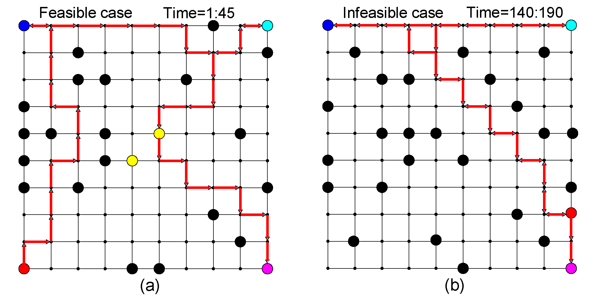
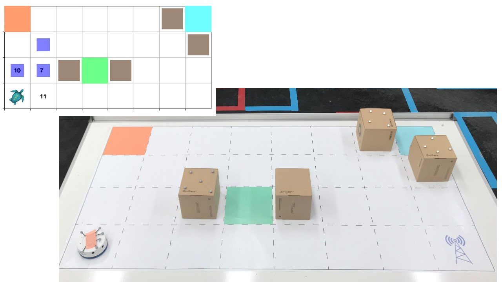

## Description

This package contains implementations for online-plan synthesis algorithm give a dynamic
environment (as the finite transition system) and a potential infeasible Linear temporal
logic formula (as the robot’s task). It outputs the predicted trajectories at each
time-step that optimize the reward-related objectives and finally fulfill the task maximumly.

[Project Webpage](https://github.com/mingyucai/Model_Predictive_Conrol-LTL)

## Results
[Simulation Vidoe](https://www.youtube.com/watch?v=RyRnKXDDH5U)
1. In the simlulations, the graph-like environments are tested.


[Experiment video](https://www.youtube.com/watch?v=16j6TmVUrTk)
2. In the experiment, the neighbor numbers of simulation snapshot provide the time-varying reward 
(Here we use the random values) which is our optimization objective.


## Publication
* Cai, Mingyu, Hao Peng, Zhijun Li, Hongbo Gao, and Zhen Kan., "Receding Horizon Control-Based Motion Planning With Partially Infeasible LTL Constraints.", IEEE Control Systems Letters 5, no. 4 (2020): 1279-1284. [[PDF]](https://ieeexplore.ieee.org/abstract/document/9234439?casa_token=cyg4D_wIfCsAAAAA:hL5irFNksL4g4YL4RWAUs1vVp5IdByJ91qUJzEAbFVrLVRwxRfUvwjS58sBLW3Clvvuwq-cA9Q)
* Cai, Mingyu, Hao Peng, Zhijun Li, Hongbo Gao, and Zhen Kan., "Receding Horizon Control-Based Motion Planning With Partially Infeasible LTL Constraints.", arXiv:2007.12123 (2020). [[PDF]](https://arxiv.org/abs/2007.12123)

## Features
- Allow both normal and infeasible LTL based product automaton task formulas
- Motion model can be dynamic and initially unknown
- Soft specification is maximumly satisfied.
- Online-Path planning is designed from the model predicted control methodology.
- Collect and transfer the real-time data via Optitrack camera systems 
- Allow automatically calibrate the mobile robots to obtain its orientation and dynamics.

## Debugging
### Ptthon3
* Install python packages like networkx2.0.ply
* Add to your PYTHONPATH, to import it in your own project.
* ltlba_32 and ltlba_64 are executable files complied under Linux, please follow [ltl2ba/README.txt]
```
Try [path_plan.py](https://github.com/mingyucai/Model-Predictive-Control/blob/master/path_plan.py) 
```
### Matlab
* Add folder to your PYTHONPATH.
```
Execute [Receding_Horizon_Control.py](https://github.com/mingyucai/Model-Predictive-Control/blob/master/Matlab_simulation/LTL_MPC/RHC_ACC.m)
```


## References
Please use this bibtex entry if you want to cite this repository in your publication:
```
@article{cai2020receding,
  title={Receding Horizon Control-Based Motion Planning With Partially Infeasible LTL Constraints},
  author={Cai, Mingyu and Peng, Hao and Li, Zhijun and Gao, Hongbo and Kan, Zhen},
  journal={IEEE Control Systems Letters},
  volume={5},
  number={4},
  pages={1279--1284},
  year={2020},
  publisher={IEEE}
}

```
